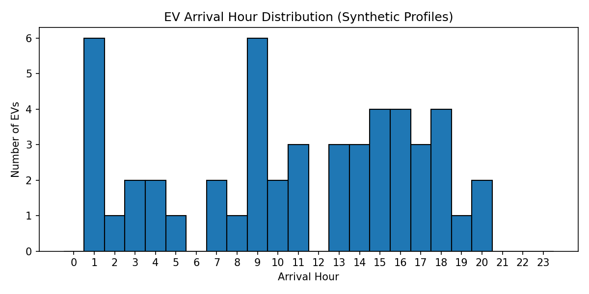
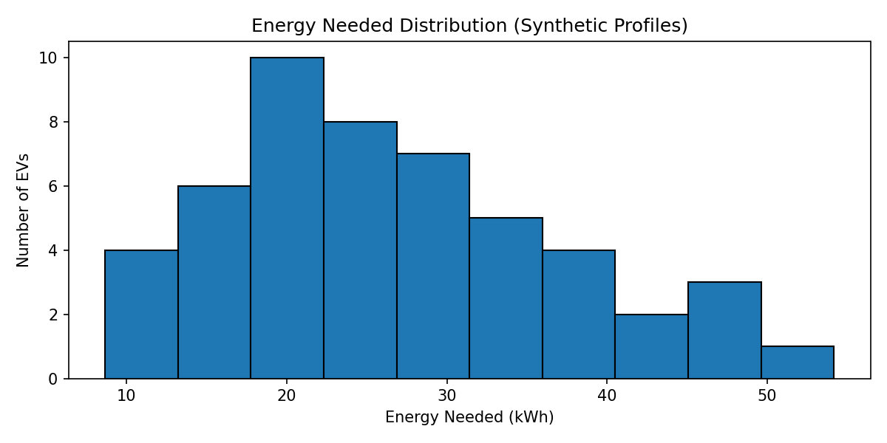

# EV Charging Simulation (Python)

Learn and practice EV charging simulation for a fleet of vehicles using hourly time steps.
Current scope covers:
- Synthetic EV profile generation (Day 1)
- **Uncontrolled charging simulation** + fleet load aggregation (Day 2)

---

## What’s implemented

### Day 1 — Synthetic EV profile generation
Generates realistic EV charging profiles for a single day:
- `arrival_hour`, `departure_hour`
- `battery_kwh`
- `initial_soc`, `target_soc`
- derived: `energy_needed_kwh`, `available_hours`

Outputs:
- `results/ev_profiles_day1.csv`
- `results/figures/arrival_hour_histogram.png`
- `results/figures/energy_needed_histogram.png`

### Day 2 — Uncontrolled charging simulation (baseline)
Implements **uncontrolled charging**:
- Charging starts immediately at `arrival_hour`
- Constant charging power (default: **7 kW**)
- Stops when energy target is reached or when `departure_hour` is reached

Outputs:
- `results/fleet_load_uncontrolled.csv` (hourly aggregate fleet load, kW)
- `results/ev_results_uncontrolled.csv` (per-EV delivered energy, shortfall, completion)
- `results/figures/aggregate_load_uncontrolled.png`

---

## Results (current run)
Configuration:
- Fleet size: 50 EVs
- Random seed: 42
- Charging power: 7 kW
- Time resolution: 1 hour (0–23)

Metrics:
- Peak load: **82.67 kW**
- Total energy delivered: **1073.94 kWh**
- Total energy needed: **1330.32 kWh**
- Completion rate: **84%**

> Completion rate < 100% is expected in uncontrolled charging because some EVs have insufficient available time (arrival–departure window) to reach the target SOC at fixed charging power.

---

## Figures

### EV arrival distribution

### Energy needed distribution

### Uncontrolled charging fleet load

---

## Assumptions
- Single-day simulation with **24 hourly slots** (0–23)
- `departure_hour` is **not inclusive**
  - Example: arrival=10, departure=13 → charging can occur at hours 10, 11, 12
- Constant charging power (no CC–CV tapering yet)
- No grid constraints, tariffs, or V2G/V2H (planned)

---

## Project structure