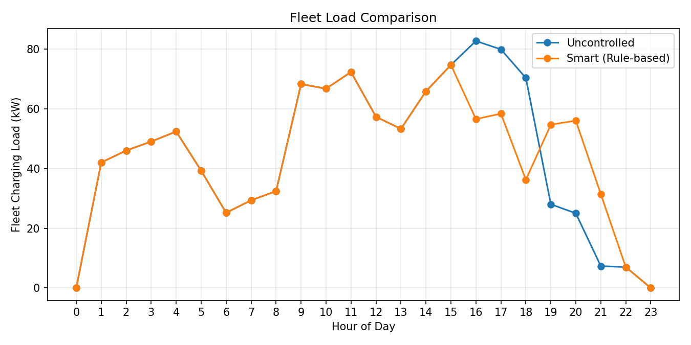

# EV Charging Simulation (Python)

Learn and practice EV charging simulation for a fleet of vehicles using hourly time steps.
Current scope covers:
- Synthetic EV profile generation (Day 1)
- **Uncontrolled charging simulation** + fleet load aggregation (Day 2)
- **Rule-based smart charging (peak avoidance) + feasibility root-cause analysis (Day 3)**

---

## What’s implemented

### Day 1 — Synthetic EV profile generation
Generates realistic EV charging profiles for a single day:
- `arrival_hour`, `departure_hour`
- `battery_kwh`
- `initial_soc`, `target_soc`
- derived: `energy_needed_kwh`, `available_hours`

Outputs:
- `results/ev_profiles_day1.csv`
- `results/figures/arrival_hour_histogram.png`
- `results/figures/energy_needed_histogram.png`

### Day 2 — Uncontrolled charging simulation (baseline)
Implements **uncontrolled charging**:
- Charging starts immediately at `arrival_hour`
- Constant charging power (default: **7 kW**)
- Stops when energy target is reached or when `departure_hour` is reached

Outputs:
- `results/fleet_load_uncontrolled.csv` (hourly aggregate fleet load, kW)
- `results/ev_results_uncontrolled.csv` (per-EV delivered energy, shortfall, completion)
- `results/figures/aggregate_load_uncontrolled.png`

### Day 3 — Rule-based smart charging + feasibility analysis
Adds a **rule-based smart charging strategy**:
- Allocates charging to **non-peak hours first** within each EV’s available window
- Uses peak hours only if needed
- Purpose: **peak shaving** without changing total delivered energy

Also adds a **feasibility/root-cause check**:
- If `energy_needed_kwh > available_hours * charging_power_kw`, the EV **cannot** complete (infeasible)
- Confirms whether incomplete sessions are due to algorithm issues or time-window constraints

Outputs:
- `results/fleet_load_smart_rule_based.csv`
- `results/ev_results_smart_rule_based.csv`
- `results/figures/fleet_load_comparison_uncontrolled_vs_smart.png`

---

## Results (current run)

Configuration:
- Fleet size: 50 EVs
- Seed: 42
- Charging power: 7 kW
- Peak avoidance hours: **[16, 17, 18]**
- Time resolution: 1 hour (0–23)

### Uncontrolled (baseline)
- Peak load: **82.67 kW**
- Total energy delivered: **1073.94 kWh**
- Total energy needed: **1330.32 kWh**
- Completion rate: **68%**
- Incomplete EVs: **16**
- Avg shortfall (incomplete only): **16.024 kWh**
- P95 shortfall (incomplete only): **37.2 kWh**

### Smart (rule-based peak avoidance)
- Peak load: **74.64 kW** (**~9.7% reduction** vs uncontrolled)
- Total energy delivered: **1073.94 kWh** (unchanged)
- Completion rate: **68%** (unchanged)
- Incomplete EVs: **16** (unchanged)

### Root-cause insight (uncontrolled)
- **Not completed but feasible:** **0**
- Interpretation: all incomplete EVs are **infeasible** given fixed charging power and limited available hours, not due to simulation logic.

---

## Figures

### EV arrival distribution


### Energy needed distribution


### Uncontrolled charging fleet load


### Fleet load comparison (uncontrolled vs smart)


---

## Assumptions
- Single-day simulation with **24 hourly slots** (0–23)
- `departure_hour` is **not inclusive**
  - Example: arrival=10, departure=13 → charging can occur at hours 10, 11, 12
- Constant charging power (no CC–CV tapering yet)
- No grid constraints, tariffs, or V2G/V2H (planned)

---

## How to run (Windows CMD)

### 1. Create and activate virtual environment
```cmd
python -m venv .venv
.venv\Scripts\activate
```

### 2. Install dependencies
```cmd
pip install -r requirements.txt
```

### 3. Run the pipeline
```cmd
python run.py
```

### 4. Outputs
Outputs are saved under `results/` and figures under `results/figures/`.

---

## Project structure
<pre>
ev-charging-simulation/
├─ src/
│  ├─ profile_generator.py      # generate + validate synthetic EV profiles
│  ├─ charging_simulator.py     # uncontrolled + rule-based smart charging
│  └─ metrics.py                # KPIs (peak load, energy, completion, shortfall stats)
├─ results/
│  ├─ ev_profiles_day1.csv
│  ├─ fleet_load_uncontrolled.csv
│  ├─ ev_results_uncontrolled.csv
│  ├─ fleet_load_smart_rule_based.csv
│  ├─ ev_results_smart_rule_based.csv
│  └─ figures/
│     ├─ arrival_hour_histogram.png
│     ├─ energy_needed_histogram.png
│     ├─ aggregate_load_uncontrolled.png
│     └─ fleet_load_comparison_uncontrolled_vs_smart.png
├─ requirements.txt
└─ run.py
</pre>